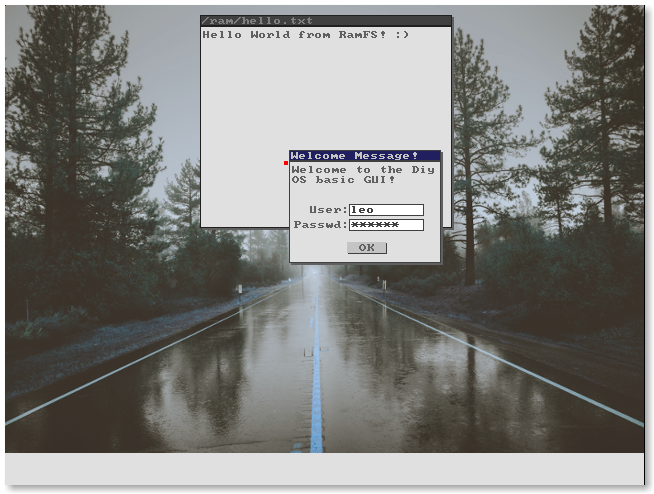

# DiyOS - do it yourself
Small study Operating System

This is a very very very experimental code, no warranties, it's for own study. :rage3:

Help me with a Star :star:

If want to compile you need a [Cross-Compiler GCC](https://wiki.osdev.org/GCC_Cross-Compiler).

---
Latest built ISO @ [build/](build/)

Latest boot screenshots



---

What is done:
* Graphical Server (initial tests)
* [Graphical User Interface](gui/) (initial tests)
* [Filesystem](kernel/filesystem) (/ and /dev)
* [Initial RAM Disk](kernel/filesystem/ramfs.c) in Tar file format. (mounted on /ram directory)
* [Multitasking](kernel/task.c)
* [Basic Message System](kernel/message.c) (IPC)
* [Memory Manager](kernel/memory/mm.c)
* [ACPI](kernel/devices/acpi.c) Reboot and Shutdown
* Global Descriptor Table (GDT)
  * Flat memory
* Interrupt Descriptor Table (IDT)
  * Basic ISR (only print a message and halt)
  * IRQs
* Paging enabled
  * Low Memory (0 ~ 1MB) identity paging
  * High-Half Kernel (kernel above 0xC0000000)
  * 4MB at 0xFFC00000 fixed for Page Tables (physical memory after kernel location)
* [Drivers](drivers/)
  * keyboard, Timer, Basic Video, PIC
  * Serial added to /dev/com file (write only)
  * Bochs VBE video
  * Basic VGA
  * ~~Network Realtek RTL81xx~~
  * ~~Network NE2000 (n2k) [working on]~~

To  compile:
```
make
```
To create a disk iso file:
```
make iso
```
To run with Qemu:
```
make run
```
