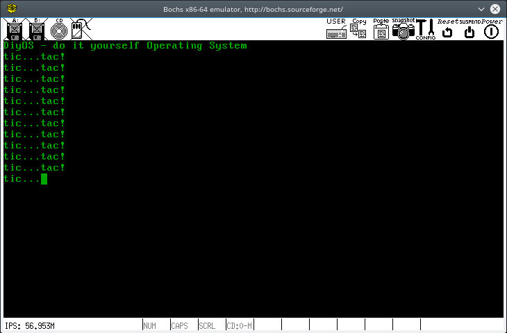

# DiyOS - do it yourself - [](https://travis-ci.org/leonardoms/DiyOS)
Small study Operating System based on a exokernel

---
Latest built ISO @ [build/](build/)

Latest boot screenshot

---

What is done:
* Global Descriptor Table (GDT)
  * Flat memory
* Interrupt Descriptor Table (IDT)
  * Basic ISR (only print a message and halt)
  * IRQs
* Paging enabled
  * Low Memory (0 ~ 1MB) identity paging
  * High-Half Kernel (kernel above 0xC0000000)
  * 4MB at 0xFFC00000 fixed for Page Tables (physical memory after kernel location)
  * kmalloc() and kfree() (bitmap manager with flags on 3-bit unused on each Page Table entry)
* Drivers
  * keyboard, Timer, Basic Video, PIC
  * Bochs VBE video
  * Network Realtek RTL81xx
  * Network NE2000 (n2k) [working on]

To  compile:
```
make
```
To create a disk iso file:
```
make iso
```
To run with Bochs (starts paused, just type 'cont' on debugger):
```
make run
```
